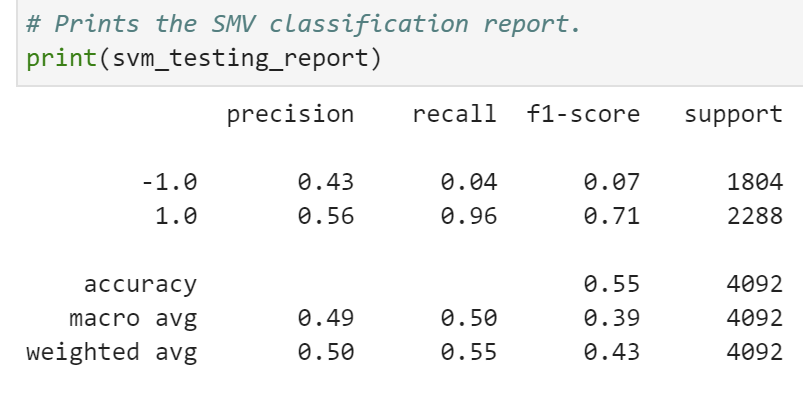
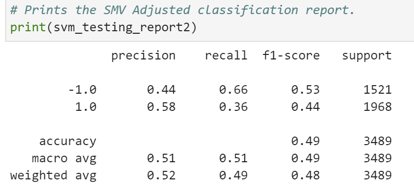

2. Tune the trading algorithm by adjusting the SMA input features. Adjust one or both of the windows for the algorithm. Rerun the notebook with the updated parameters, and record the results in your `README.md` file. Answer the following question: What impact resulted from increasing or decreasing either or both of the SMA windows?

3. Choose the set of parameters that best improved the trading algorithm returns. Save a PNG image of the cumulative product of the actual returns vs. the strategy returns, and document your conclusion in your `README.md` file.

3. Backtest the new model to evaluate its performance. Save a PNG image of the cumulative product of the actual returns vs. the strategy returns for this updated trading algorithm, and write your conclusions in your `README.md` file. Answer the following questions: Did this new model perform better or worse than the provided baseline model? Did this new model perform better or worse than your tuned trading algorithm?

In the previous sections, you updated your `README.md` file with your conclusions. To accomplish this section, you need to add a summary evaluation report at the end of the `README.md` file. For this report, express your final conclusions and analysis. Support your findings by using the PNG images that you created.

# Machine Learning Trading Bot Report

## Overview of the Analysis

This notebook will use two different forms of machine learning to test the current existing algorithm and plans on possibly improving on it's current results to improve the firm's competitive advantage in the market. 

To do so, the notebook will enhance the existing trading signals with machine learning algorithms that can adapt to new data. It will do this by reading in the CSV file(emerging_markets_ohlcv.csv) and running the original algorithm. From there the notebook will adjust the baseline algorithm to see if a new outlook might perform better. It will then test a different classifier to see if this can improve performance. Below are the results gathered from these attempts to improve on the algorithm.

## Results

We will be comparing the baseline algorithm with a modification to this algorithm. We will also try a different algorithm. We will see which one produced the best results.

* Baseline Algorithm
  

  
As we can see, the original has an accuracy of about 55%. This is not bad, but could possibly be improved on.

 

Viewing this plot we can see how the algorithm performed when tested against the actual returns. It stays about the same for a good portion, but does begin to out perform the actual returns, showing that it does possess potential to make money.

* Adjusted Algorithm
For this one, the SMA was moved to 50 and 200 days to see if more data might perform better. With the increased SMAs the training data was increased to see how this would play out over a longer time period.

  
Extending the window dropped the accuracy to 49% unfortunately. So this does not seem to have helped the algorithm.

 

Viewing this plot we can see how the algorithm performed when tested against the actual returns. It stays about the same for a good portion, but does begin to out perform the actual returns, showing that it does possess potential to make money.
  
## Summary

From the above data, we can conclude that the Oversampling allowed the model to better predict if a loan was going to default or not. The Oversampling increased the Accuraccy and the Recall significantly. We noticed a slight loss in precision, but that is normal. A fundamental tension exists between the precision and the recall, so it depends on which of these factors we wish to be more correct.

This will fully depend on what we are trying to achieve here, if we are trying to minimize offering loans to those that might potentially default, then the Oversampling Model appears to offer us a much better option. If we are just trying to lend out the money without worrying too much about defaults (as they are a low occurance at 3.33%), then we can be happy with just the LR Model. Overall, both Models do a great job at having over 95% accuracy and above 90% Recall.

As I feel that we are attempting to reduce our Defaults, I would suggest that we use the Oversampling Model to reduce that possibility.