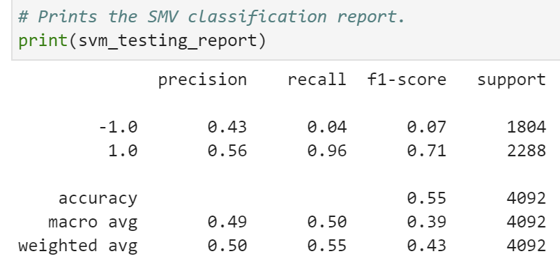
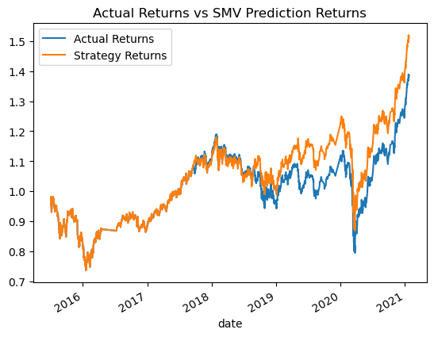
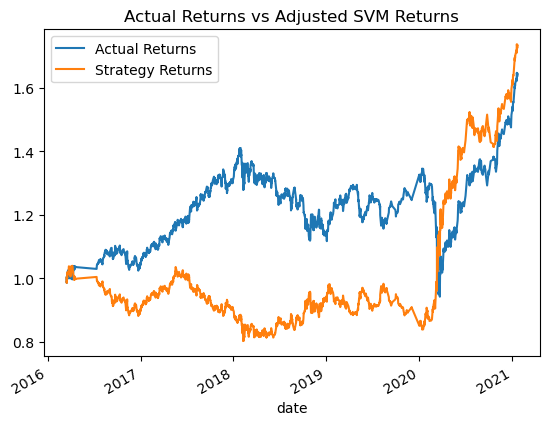
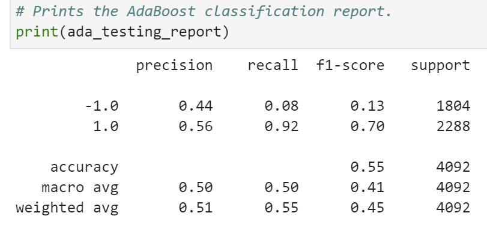
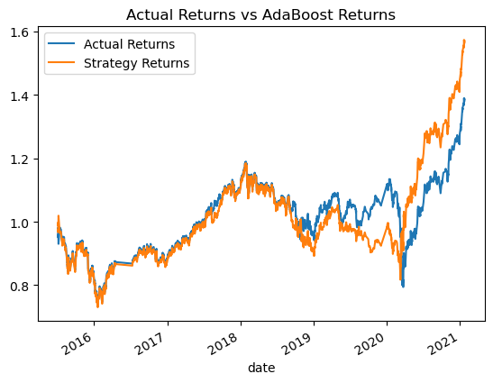

# Machine Learning Trading Bot Report

## Overview of the Analysis

This notebook will use two different forms of machine learning to test the current existing algorithm and plans on possibly improving on it's current results to improve the firm's competitive advantage in the market. 

To do so, the notebook will enhance the existing trading signals with machine learning algorithms that can adapt to new data. It will do this by reading in the CSV file(emerging_markets_ohlcv.csv) and running the original algorithm. From there the notebook will adjust the baseline algorithm to see if a new outlook might perform better. It will then test a different classifier to see if this can improve performance. Below are the results gathered from these attempts to improve on the algorithm.

## Results

We will be comparing the baseline algorithm with a modification to this algorithm. We will also try a different algorithm. We will see which one produced the best results.

### **Baseline Algorithm**
  

  
As we can see, the original has an accuracy of about 55%. This is not bad, but could possibly be improved on.

 

Viewing this plot we can see how the algorithm performed when tested against the actual returns. It stays about the same for a good portion, but does begin to out perform the actual returns, showing that it does possess potential to make money.

---

### **Adjusted Algorithm**

For this one, the SMA was moved to 50 and 200 days to see if more data might perform better. With the increased SMAs the training data was increased to see how this would play out over a longer time period.

   
  
Extending the window dropped the accuracy to 49% unfortunately. So this does not seem to have helped the algorithm, though the precision did improve.

    

Upon checking the plot though, we can see that it did not perform well at all and took a bit of time to recover. It does end in the positive, but it took it a while to get there. It does appear that it did it's best recovery when the market went down, which might mean this strategy can be used to mitigate risk for when the market might be sloping downward.

---

### **AdaBoost Algorithm**

For the last one, a new classifier was used. It is always good to test new machine learning models as some of them may utilize new methods that can optimize performance.

  
Though this one shows the same accuracy at 55%, you can see some minor improvements in precision.

 

Viewing this plot, we can see that at first this model did about the same as the baseline, but at the end it appears that the returns it finishes with are a little better than the baseline. Though we can also see that when the market was having a little volatility it started to underperform the baseline.

---

## Summary

From the above data, it would appear that the baseline works well in a general sense, but that we also have two additional optional models we can use if the market is taking a swing down or up. During a downward move, it appears the Adjusted Model reads those signals better and can make a profit from these conditions. While the AdaBoost model appears to fully take advantage of a market moving upwards.

In these instances, watching the market and possibly switching models on accounts based on the direction the market is moving with the investment portfolios could result in less loss and more gains overall.