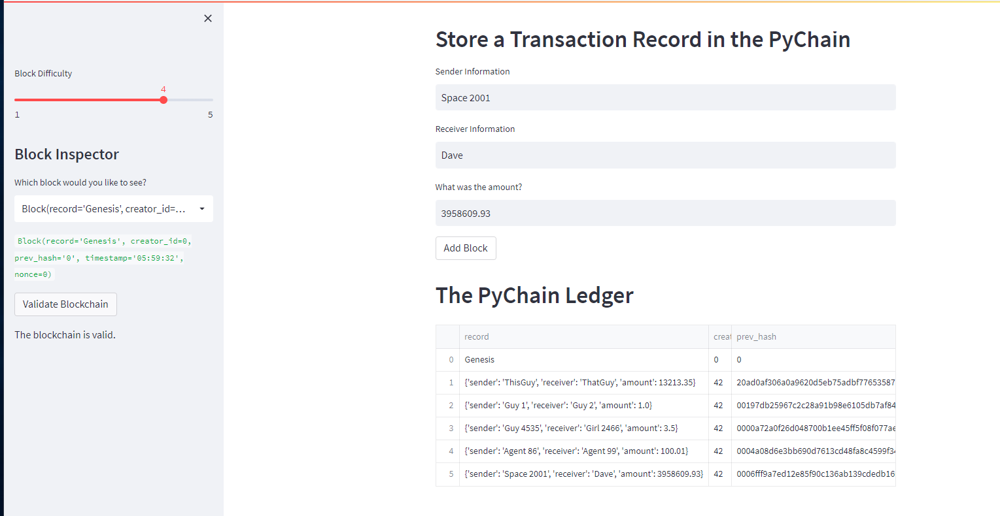

# PyChain Decentralized Ledger

For the company, this is a blockchain-based ledger system, complete with a user-friendly web interface. This ledger allows partner banks to conduct financial transactions (that is, to transfer money between senders and receivers) and to allows the company to verify the integrity of the data in the ledger.

All three methods will be evaluated and reported upon in an accompanying report (EvaluationReport.md).
---

## Technologies

This project utilizes a lot of different add ons, please make sure you have all these and they are up to date:

* [pandas 1.4.3](https://github.com/pandas-dev/pandas/blob/main/README.md) - For the dataframe information for the blockchain.

* [streamlit 1.12.0](https://github.com/streamlit/streamlit) - For the frontend for the program.

* [dataclasses 0.8](https://github.com/python/cpython/blob/main/Lib/dataclasses.py) - For creating our own data classes.

* [typing 4.3.0](https://github.com/python/cpython/blob/main/Lib/typing.py) - For Any and List items.

* [hashlib](https://github.com/python/cpython/blob/main/Lib/hashlib.py) - For encoding the data.
---

## Installation Guide

If StreamLit needs to be installed, please run this command below.

```python

    pip install streamlit
    
```

---

## Usage

In your console, go to the folder that holds pychain.py and enter: streamlit run pychain.py.

You will then load a webpage console that appears as shown:


This also shows that the validation aspect is working as well.

---
## Contributors

### Matthew Stream
m.stream3663@gmail.com

[LinkedIn](https://www.linkedin.com/in/matthew-stream-mba-215634102/)

---

## License

MIT