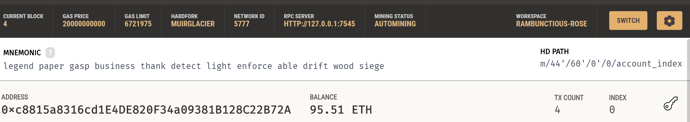
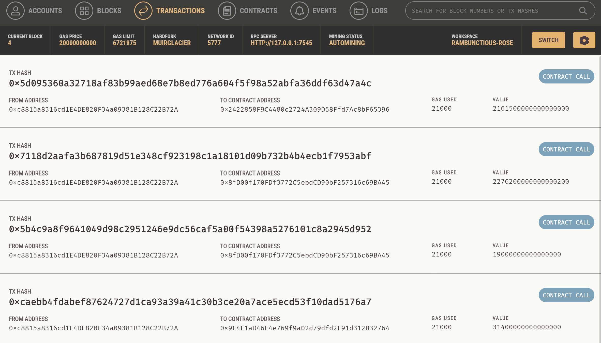

# Fintech Finder

Fintech Finder is an application that its customers can use to find fintech professionals from among a list of candidates, hire them, and pay them. It integrates the Ethereum blockchain network into the application in order to enable your customers to instantly pay the fintech professionals whom they hire with cryptocurrency via web appliation. It does this via 2 python files that run all the background information.

---

## Technologies

This project utilizes a lot of different add ons, please make sure you have all these and they are up to date:

* [pandas v1.4.4](https://github.com/pandas-dev/pandas/blob/main/README.md) - For reading the csv files and other operations.

* [python-dotenv v0.20.0](https://github.com/theskumar/python-dotenv) - For reading .env files.

* [web3 v5.17](https://github.com/ethereum/web3.py) - For connecting to Ganache and the Etherium database information.

* [bip44 v0.1.2](https://github.com/bitcoin/bips/blob/master/bip-0044.mediawiki) - For creating the cyrpto wallet object.

* [streamlit 1.12.0](https://github.com/streamlit/streamlit) - For the frontend for the program.

---

## Installation Guide

Be sure you can import these local tools in to your Jupyter Lab as they will be necessary for the program.

```python
    
    import os
    import requests
    from dataclasses import dataclass
    from typing import Any, List
  
```

Please make sure these files are installed as well.

```python

    pip install web3==5.17
    pip install bip44

```

You will also need to have the Ganache program installed and be utilizing the correct instance so that the program will talk to the correct accounts. Update your SAMPLE.env file accordingly.

---

## Usage

To access the Fintech Finder webpage, please begin by opening your terminal and navigating to the folder that contains fintech_finder.py. Run the following command to open the webpage.

```python
streamlit run fintech_finder.py
```

Once on the webpage it should be pretty easy to see how to navigate to the options you wish and create a contract with one of the Fintech Professionals.

Ganache account use documentation:



Please let us know if you have any further questions.

---
## Contributors

### Matthew Stream
m.stream3663@gmail.com

[LinkedIn](https://www.linkedin.com/in/matthew-stream-mba-215634102/)

---

## License

MIT