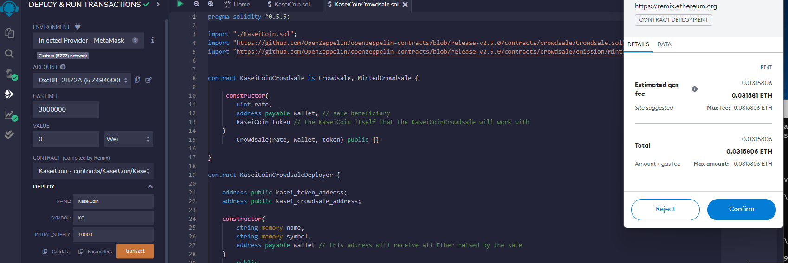

# Kasei Coin

The Martian Aerospace Agency wants to be part of the first human colony on Mars. They want to develop a monetary system for the new Mars colony. They have decided to base this new monetary system on blockchain technology, and to define a new cryptocurrency called KaseiCoin. (“Kasei” means “Mars” in Japanese.)

KaseiCoin will be a fungible token that is ERC-20 compliant. A crowdsale will allow people who are moving to Mars to convert their earthling money to KaseiCoin.

---

## Technologies

This project utilizes Remix - Ethereum IDE, Ganache, MetaMask, and Solidity, you will just need to go to the link to use it:

* [MetaMask](https://metamask.io/download/) - Digital Wallet for the Ethereum blockchain.
* [Remix - Ethereum IDE](https://remix.ethereum.org/#optimize=false&runs=200&evmVersion=null&version=soljson-v0.5.0+commit.1d4f565a.js&language=Solidity) - For running the smart contract.

---

## Installation Guide

Install MetaMask if you do not have it. Everything else you should already possess.

Use the link above and then load in the accompanying `KaseiCoin.sol` and `KaseiCoinCrowdsale.sol` files.

---

## Usage

Deploy and Run the `KaseiCoinCrowdsaleDeployer` part of KaseiCoinCrowdsale, then run the `KaseiCoinCrowdsale` contract to begin interactions with it. As shown with the following screenshots.

---
#### Contract Complied

#### Contract Deployed

#### Purchasing Coins

Please let us know if you have any further questions.

---
## Contributors

### Matthew Stream
m.stream3663@gmail.com

[LinkedIn](https://www.linkedin.com/in/matthew-stream-mba-215634102/)

---

## License

MIT